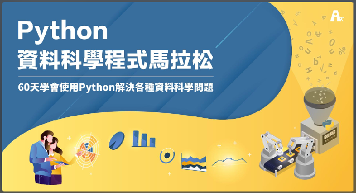

# Python 資料科學程式馬拉松

  
[課程連結](https://www.cupoy.com/marathon/00000174C4BC1B93000000016375706F795F70726572656C656173654355)

## 學習大綱
* [NumPy 程式開發實作](#NumPy_程式開發實作)
* [Pandas 程式開發實作](#Pandas_程式開發實作)  
* [Matplotlib / Seaborn 資料視覺化](#Matplotlib/Seaborn_資料視覺化)
* [統計的基礎知識](#統計的基礎知識)
* [手把手來場資料科學專案吧!](#手把手來場資料科學專案吧)
* [期末專題實作](#專題實作)

## NumPy_程式開發實作

| 主題 | 範例 | 作業 | 作業解答 | 
| ---------- | :-----------: | :-----------: | :-----------: | 
| NumPy 基本操作   v2: NumPy 陣列的定義與屬性 | [Day_01_Sample](https://github.com/YenLinWu/DataScienceMarathon/blob/main/Sample%20Code/Day_01_SampleCode.ipynb)   [Day_01_Sample_v2](https://github.com/YenLinWu/Data_Science_Marathon/blob/main/Sample%20Code/Day_01_SampleCode_v2.ipynb) | [Day_01_HW](https://github.com/YenLinWu/DataScienceMarathon/blob/main/Homework/Day_01_HW.ipynb) | [Day_01_Solution](https://github.com/YenLinWu/DataScienceMarathon/blob/main/Solution/Day_01_Solution.ipynb)   [Day_01_Solution_v2](https://github.com/YenLinWu/Data_Science_Marathon/blob/main/Solution/Day_01_Solution_v2.ipynb) |  
| NumPy 陣列進階操作   v2: NumPy 陣列中不同的資料型態 | [Day_02_Sample](https://github.com/YenLinWu/DataScienceMarathon/blob/main/Sample%20Code/Day_02_SampleCode.ipynb)   [Day_02_Sample_v2](https://github.com/YenLinWu/Data_Science_Marathon/blob/main/Sample%20Code/Day_02_SampleCode_v2.ipynb)  | [Day_02_HW](https://github.com/YenLinWu/DataScienceMarathon/blob/main/Homework/Day_02_HW.ipynb) | [Day_02_Solution](https://github.com/YenLinWu/DataScienceMarathon/blob/main/Solution/Day_02_Solution.ipynb)   [Day_02_Solution_v2](https://github.com/YenLinWu/Data_Science_Marathon/blob/main/Solution/Day_02_Solution_v2.ipynb) |
| NumPy 陣列運算及數學函式   v2: NumPy 陣列的初始化 | [Day_03_Sample](https://github.com/YenLinWu/DataScienceMarathon/blob/main/Sample%20Code/Day_03_SampleCode.ipynb)   [Day_03_Sample_v2](https://github.com/YenLinWu/Data_Science_Marathon/blob/main/Sample%20Code/Day_03_SampleCode_v2.ipynb) | [Day_03_HW](https://github.com/YenLinWu/DataScienceMarathon/blob/main/Homework/Day_03_HW.ipynb) | [Day_03_Solution](https://github.com/YenLinWu/DataScienceMarathon/blob/main/Solution/Day_03_Solution.ipynb)   [Day_03_Solution_v2](https://github.com/YenLinWu/Data_Science_Marathon/blob/main/Solution/Day_03_Solution_v2.ipynb)  |  
| NumPy 陣列邏輯函式   v2: NumPy 陣列的算術運算 | [Day_04_Sample](https://github.com/YenLinWu/DataScienceMarathon/blob/main/Sample%20Code/Day_04_SampleCode.ipynb)   [Day_04_Sample_v2](https://github.com/YenLinWu/Data_Science_Marathon/blob/main/Sample%20Code/Day_04_SampleCode_v2.ipynb) | [Day_04_HW](https://github.com/YenLinWu/DataScienceMarathon/blob/main/Homework/Day_04_HW.ipynb) | [Day_04_Solution](https://github.com/YenLinWu/DataScienceMarathon/blob/main/Solution/Day_04_Solution.ipynb)   [Day_04_Solution_v2](https://github.com/YenLinWu/Data_Science_Marathon/blob/main/Solution/Day_04_Solution_v2.ipynb) |  
| NumPy 統計函式   v2: NumPy 陣列的邏輯運算 | [Day_05_Sample](https://github.com/YenLinWu/DataScienceMarathon/blob/main/Sample%20Code/Day_05_SampleCode.ipynb)   [Day_05_Sample_v2](https://github.com/YenLinWu/Data_Science_Marathon/blob/main/Sample%20Code/Day_05_SampleCode_v2.ipynb) | [Day_05_HW](https://github.com/YenLinWu/DataScienceMarathon/blob/main/Homework/Day_05_HW.ipynb) | [Day_05_Solution](https://github.com/YenLinWu/DataScienceMarathon/blob/main/Solution/Day_05_Solution.ipynb)   [Day_05_Solution_v2](https://github.com/YenLinWu/Data_Science_Marathon/blob/main/Solution/Day_05_Solution_v2.ipynb) |  
| 使用 NumPy 存取各種檔案內容   v2: NumPy 中常見的陣列方法與函式 | [Day_06_Sample](https://github.com/YenLinWu/DataScienceMarathon/blob/main/Sample%20Code/Day_06_SampleCode.ipynb)   [Day_06_Sample_v2](https://github.com/YenLinWu/Data_Science_Marathon/blob/main/Sample%20Code/Day_06_SampleCode_v2.ipynb) | [Day_06_HW](https://github.com/YenLinWu/DataScienceMarathon/blob/main/Homework/Day_06_HW.ipynb) | [Day_06_Solution](https://github.com/YenLinWu/DataScienceMarathon/blob/main/Solution/Day_06_Solution.ipynb)   [Day_06_Solution_v2](https://github.com/YenLinWu/Data_Science_Marathon/blob/main/Solution/Day_06_Solution_v2.ipynb) |  
| NumPy 的矩陣函式與線性代數應用   v2: NumPy 陣列的索引、切片和迭代 | [Day_07_Sample](https://github.com/YenLinWu/DataScienceMarathon/blob/main/Sample%20Code/Day_07_SampleCode.ipynb)   [Day_07_Sample_v2](https://github.com/YenLinWu/Data_Science_Marathon/blob/main/Sample%20Code/Day_07_SampleCode_v2.ipynb) | [Day_07_HW](https://github.com/YenLinWu/DataScienceMarathon/blob/main/Homework/Day_07_HW.ipynb) | [Day_07_Solution](https://github.com/YenLinWu/DataScienceMarathon/blob/main/Solution/Day_07_Solution.ipynb)   [Day_07_Solution_v2](https://github.com/YenLinWu/Data_Science_Marathon/blob/main/Solution/Day_07_Solution_v2.ipynb) |  
| NumPy 結構化陣列(Structured Arrays) | [Day_08_Sample](https://github.com/YenLinWu/DataScienceMarathon/blob/main/Sample%20Code/Day_08_SampleCode.ipynb) | [Day_08_HW](https://github.com/YenLinWu/DataScienceMarathon/blob/main/Homework/Day_08_HW.ipynb) | [Day_08_Solution](https://github.com/YenLinWu/DataScienceMarathon/blob/main/Solution/Day_08_Solution.ipynb) |  

Back to [學習大綱](#學習大綱)

## Pandas_程式開發實作

| 主題 | 範例 | 作業 | 作業解答 | 
| ---------- | :-----------: | :-----------: | :-----------: | 
| v2: Pandas 物件的定義與屬性 | [Day_08_Sample_v2](https://github.com/YenLinWu/Data_Science_Marathon/blob/main/Sample%20Code/Day_08_SampleCode_v2.ipynb) | | [Day_08_Solution_v2](https://github.com/YenLinWu/Data_Science_Marathon/blob/main/Solution/Day_08_Solution_v2.ipynb) |  
| 使用 Pandas 讀寫各種常用的檔案格式   v2: Pandas DataFrame 的初始化 | [Day_09_Sample](https://github.com/YenLinWu/DataScienceMarathon/blob/main/Sample%20Code/Day_09_SampleCode.ipynb)   [Day_09_Sample_v2](https://github.com/YenLinWu/Data_Science_Marathon/blob/main/Sample%20Code/Day_09_SampleCode_v2.ipynb)| [Day_09_HW](https://github.com/YenLinWu/DataScienceMarathon/blob/main/Homework/Day_09_HW.ipynb) | [Day_09_Solution](https://github.com/YenLinWu/DataScienceMarathon/blob/main/Solution/Day_09_Solution.ipynb)   [Day_09_Solution_v2](https://github.com/YenLinWu/Data_Science_Marathon/blob/main/Solution/Day_09_Solution_v2.ipynb) |  
| Pandas 資料索引操作(資料過濾、選擇、合併)   v2: Pandas DataFrame 的資料選取 | [Day_10_Sample](https://github.com/YenLinWu/DataScienceMarathon/blob/main/Sample%20Code/Day_10_SampleCode.ipynb)   [Day_10_Sample_v2](https://github.com/YenLinWu/Data_Science_Marathon/blob/main/Sample%20Code/Day_10_SampleCode_v2.ipynb)| [Day_10_HW](https://github.com/YenLinWu/DataScienceMarathon/blob/main/Homework/Day_10_HW.ipynb) | [Day_10_Solution](https://github.com/YenLinWu/DataScienceMarathon/blob/main/Solution/Day_10_Solution.ipynb)   [Day_10_Solution_v2](https://github.com/YenLinWu/Data_Science_Marathon/blob/main/Solution/Day_10_Solution_v2.ipynb) |  
| Pandas 類別資料與缺失值處理   v2: Pandas 中的算術運算特性 | [Day_11_Sample](https://github.com/YenLinWu/DataScienceMarathon/blob/main/Sample%20Code/Day_11_SampleCode.ipynb)   [Day_11_Sample_v2](https://github.com/YenLinWu/Data_Science_Marathon/blob/main/Sample%20Code/Day_11_SampleCode_v2.ipynb) | [Day_11_HW](https://github.com/YenLinWu/DataScienceMarathon/blob/main/Homework/Day_11_HW.ipynb) | [Day_11_Solution](https://github.com/YenLinWu/DataScienceMarathon/blob/main/Solution/Day_11_Solution.ipynb)   [Day_11_Solution_v2](https://github.com/YenLinWu/Data_Science_Marathon/blob/main/Solution/Day_11_Solution_v2.ipynb) |  
| v2: Pandas 迭代與重複操作 | [Day_12_Sample_v2](https://github.com/YenLinWu/DataScienceMarathon/blob/main/Sample%20Code/Day_12_SampleCode_v2.ipynb) | [Day_12_HW_v2](https://github.com/YenLinWu/DataScienceMarathon/blob/main/Homework/Day_12_HW_v2.ipynb) | [Day_12_Solution_v2](https://github.com/YenLinWu/DataScienceMarathon/blob/main/Solution/Day_12_Solution_v2.ipynb) |  
| v2: Pandas DataFrame 的新增與刪除 | [Day_13_Sample_v2](https://github.com/YenLinWu/DataScienceMarathon/blob/main/Sample%20Code/Day_13_SampleCode_v2.ipynb) | [Day_13_HW_v2](https://github.com/YenLinWu/DataScienceMarathon/blob/main/Homework/Day_13_HW_v2.ipynb) | [Day_13_Solution_v2](https://github.com/YenLinWu/DataScienceMarathon/blob/main/Solution/Day_13_Solution_v2.ipynb) |  
| v2: Pandas 的外部資料存取 | [Day_14_Sample_v2](https://github.com/YenLinWu/DataScienceMarathon/blob/main/Sample%20Code/Day_14_SampleCode_v2_II.ipynb) | [Day_14_HW_v2](https://github.com/YenLinWu/Data_Science_Marathon/blob/main/Homework/Day_14_HW_v2_II.ipynb) | [Day_14_Solution_v2](https://github.com/YenLinWu/DataScienceMarathon/blob/main/Solution/Day_14_Solution_v2_II.ipynb) |  
| Pandas 常見圖表程式設計 | [Day_12_Sample](https://github.com/YenLinWu/DataScienceMarathon/blob/main/Sample%20Code/Day_12_SampleCode.ipynb) | [Day_12_HW](https://github.com/YenLinWu/DataScienceMarathon/blob/main/Homework/Day_12_HW.ipynb) | [Day_12_Solution](https://github.com/YenLinWu/DataScienceMarathon/blob/main/Solution/Day_12_Solution.ipynb) |  
| Pandas 統計函式使用教學 | [Day_13_Sample](https://github.com/YenLinWu/DataScienceMarathon/blob/main/Sample%20Code/Day_13_SampleCode.ipynb) | [Day_13_HW](https://github.com/YenLinWu/DataScienceMarathon/blob/main/Homework/Day_13_HW.ipynb) | [Day_13_Solution](https://github.com/YenLinWu/DataScienceMarathon/blob/main/Solution/Day_13_Solution.ipynb) |  
| Pandas 撰寫樞紐分析表 | [Day_14_Sample](https://github.com/YenLinWu/DataScienceMarathon/blob/main/Sample%20Code/Day_14_SampleCode.ipynb) | [Day_14_HW](https://github.com/YenLinWu/DataScienceMarathon/blob/main/Homework/Day_14_HW.ipynb) | [Day_14_Solution](https://github.com/YenLinWu/DataScienceMarathon/blob/main/Solution/Day_14_Solution.ipynb) |  
| Pandas Split-Apply-Combine Strategy | [Day_15_Sample](https://github.com/YenLinWu/DataScienceMarathon/blob/main/Sample%20Code/Day_15_SampleCode.ipynb) | [Day_15_HW](https://github.com/YenLinWu/DataScienceMarathon/blob/main/Homework/Day_15_HW.ipynb) | [Day_15_Solution](https://github.com/YenLinWu/DataScienceMarathon/blob/main/Solution/Day_15_Solution.ipynb) |  
| Pandas 時間序列 | [Day_16_Sample](https://github.com/YenLinWu/DataScienceMarathon/blob/main/Sample%20Code/Day_16_SampleCode.ipynb) | [Day_16_HW](https://github.com/YenLinWu/DataScienceMarathon/blob/main/Homework/Day_16_HW.ipynb) | [Day_16_Solution](https://github.com/YenLinWu/DataScienceMarathon/blob/main/Solution/Day_16_Solution.ipynb) |  
| Pandas 效能調校 | [Day_17_Sample](https://github.com/YenLinWu/DataScienceMarathon/blob/main/Sample%20Code/Day_17_SampleCode.ipynb) | [Day_17_HW](https://github.com/YenLinWu/DataScienceMarathon/blob/main/Homework/Day_17_HW.ipynb) | [Day_17_Solution](https://github.com/YenLinWu/DataScienceMarathon/blob/main/Solution/Day_17_Solution.ipynb) |  

Back to [學習大綱](#學習大綱)

## Matplotlib/Seaborn_資料視覺化  

| 主題 | 範例 | 作業 | 作業解答 | 
| ---------- | :-----------: | :-----------: | :-----------: | 
| Python 資料視覺化工具與常見統計圖表介紹 | [Day_18_Sample](https://github.com/YenLinWu/DataScienceMarathon/blob/main/Sample%20Code/Day_18_SampleCode.ipynb) | [Day_18_HW](https://github.com/YenLinWu/DataScienceMarathon/blob/main/Homework/Day_18_HW.ipynb) | [Day_18_Solution](https://github.com/YenLinWu/DataScienceMarathon/blob/main/Solution/Day_18_Solution.ipynb) |  
| 使用 Matplotlib 繪製各種常用圖表 | [Day_19_Sample](https://github.com/YenLinWu/DataScienceMarathon/blob/main/Sample%20Code/Day_19_SampleCode.ipynb) | [Day_19_HW](https://github.com/YenLinWu/DataScienceMarathon/blob/main/Homework/Day_19_HW.ipynb) | [Day_19_Solution](https://github.com/YenLinWu/DataScienceMarathon/blob/main/Solution/Day_19_Solution.ipynb) |  
| 使用 Seaborn 進行資料視覺化 | [Day_20_Sample](https://github.com/YenLinWu/DataScienceMarathon/blob/main/Sample%20Code/Day_20_SampleCode.ipynb) | [Day_20_HW](https://github.com/YenLinWu/DataScienceMarathon/blob/main/Homework/Day_20_HW.ipynb) | [Day_20_Solution](https://github.com/YenLinWu/DataScienceMarathon/blob/main/Solution/Day_20_Solution.ipynb) |  
| 運用實際資料集進行資料視覺化練習 | [Day_21_Sample](https://github.com/YenLinWu/DataScienceMarathon/blob/main/Sample%20Code/Day_21_SampleCode.ipynb) | [Day_21_HW](https://github.com/YenLinWu/DataScienceMarathon/blob/main/Homework/Day_21_HW.ipynb) | [Day_21_Solution](https://github.com/YenLinWu/DataScienceMarathon/blob/main/Solution/Day_21_Solution.ipynb) |   
| 結合 Pandas 與 Matploglib 進行進階資料視覺化練習 | [Day_22_Sample](https://github.com/YenLinWu/DataScienceMarathon/blob/main/Sample%20Code/Day_22_SampleCode.ipynb) | [Day_22_HW](https://github.com/YenLinWu/DataScienceMarathon/blob/main/Homework/Day_22_HW.ipynb) | [Day_22_Solution](https://github.com/YenLinWu/DataScienceMarathon/blob/main/Solution/Day_22_Solution.ipynb) | 
| Bokeh 輕鬆以網頁呈現視覺化圖表 | [Day_23_Sample](https://github.com/YenLinWu/DataScienceMarathon/blob/main/Sample%20Code/Day_23_SampleCode.ipynb) | [Day_23_HW](https://github.com/YenLinWu/DataScienceMarathon/blob/main/Homework/Day_23_HW.ipynb) | [Day_23_Solution](https://github.com/YenLinWu/DataScienceMarathon/blob/main/Solution/Day_23_Solution.ipynb) | 
| Basemap 進行地理資訊繪圖 | [Day_24_Sample](https://github.com/YenLinWu/DataScienceMarathon/blob/main/Sample%20Code/Day_24_SampleCode.ipynb) | [Day_24_HW](https://github.com/YenLinWu/DataScienceMarathon/blob/main/Homework/Day_24_HW.ipynb) | [Day_24_Solution](https://github.com/YenLinWu/DataScienceMarathon/blob/main/Solution/Day_24_Solution.ipynb) | 
| 使用 Pandas 與 Basemap 將數據整合於地理資訊圖表 | [Day_25_Sample](https://github.com/YenLinWu/DataScienceMarathon/blob/main/Sample%20Code/Day_25_SampleCode.ipynb) | [Day_25_HW](https://github.com/YenLinWu/DataScienceMarathon/blob/main/Homework/Day_25_HW.ipynb) | [Day_25_Solution](https://github.com/YenLinWu/DataScienceMarathon/blob/main/Solution/Day_25_Solution.ipynb) |   

Back to [學習大綱](#學習大綱)

## 統計的基礎知識 

### Probability Distribution
- [離散型均勻分布( Discrete Uniform Distribution )](https://zh.wikipedia.org/wiki/%E9%9B%A2%E6%95%A3%E5%9E%8B%E5%9D%87%E5%8B%BB%E5%88%86%E4%BD%88)  
- [伯努利分佈( Bernoulli Distribution )](https://zh.wikipedia.org/wiki/%E4%BC%AF%E5%8A%AA%E5%88%A9%E5%88%86%E5%B8%83)  
> 為一伯努力試驗(Bernoulli Trail)，即表示只有兩種結果(成功、失敗)的隨機試驗。  
- [二項式分佈( Binomial Distribution )](https://zh.wikipedia.org/wiki/%E4%BA%8C%E9%A0%85%E5%BC%8F%E5%88%86%E5%B8%83)  
> 為一伯努利過程(Bernoulli Process)，係重複 n 次伯努利試驗，其中，當 n=1 時為伯努利分佈。
- [負二項式分佈( Negative Binomial Distribution )](https://zh.wikipedia.org/wiki/%E8%B4%9F%E4%BA%8C%E9%A1%B9%E5%88%86%E5%B8%83)  
> 持續進行伯努利試驗，直到第 r 次成功時才停止，伯努利試驗總共進行 X 次的機率分佈。  
- [超幾何分佈( Hypergeometric Distribution )](https://zh.wikipedia.org/wiki/%E8%B6%85%E5%87%A0%E4%BD%95%E5%88%86%E5%B8%83) 
> 在 N 個樣本中有 K 個為我們所關心的類型樣本。從 N 個樣本中取出 n 個(取後不放回)，而這 n 個當中有 k 個屬於我們所關心的類型的機率。  
- [常態分佈( Normal Distribution )](https://zh.wikipedia.org/wiki/%E6%AD%A3%E6%80%81%E5%88%86%E5%B8%83)

### Reference 
- [Standardizing](https://www.mathsisfun.com/data/standard-normal-distribution.html)  
- [Introduction to Bayesian Inference](https://towardsdatascience.com/introduction-to-bayesian-inference-18e55311a261)  
- [Bayesian Inference](https://seeing-theory.brown.edu/bayesian-inference/index.html)
- [How Bayesian inference works](https://e2eml.school/how_bayesian_inference_works.html)

| 主題 | 範例 | 作業 | 作業解答 | 
| ---------- | :-----------: | :-----------: | :-----------: | 
| 用統計描述資料的樣態 | [Day_26_Sample](https://github.com/YenLinWu/DataScienceMarathon/blob/main/Sample%20Code/Day_26_SampleCode.ipynb) | [Day_26_HW](https://github.com/YenLinWu/DataScienceMarathon/blob/main/Homework/Day_26_HW.ipynb) | [Day_26_Solution](https://github.com/YenLinWu/DataScienceMarathon/blob/main/Solution/Day_26_Solution.ipynb) |   
| 用機率分佈描述亂中有序的世界 - 離散型分配(1) | [Day_27_Sample](https://github.com/YenLinWu/DataScienceMarathon/blob/main/Sample%20Code/Day_27_SampleCode.ipynb) | [Day_27_HW](https://github.com/YenLinWu/DataScienceMarathon/blob/main/Homework/Day_27_HW.ipynb) | [Day_27_Solution](https://github.com/YenLinWu/DataScienceMarathon/blob/main/Solution/Day_27_Solution.ipynb) |  
| 用機率分佈描述亂中有序的世界 - 離散型分配(2) | [Day_28_Sample](https://github.com/YenLinWu/DataScienceMarathon/blob/main/Sample%20Code/Day_28_SampleCode.ipynb) | [Day_28_HW](https://github.com/YenLinWu/DataScienceMarathon/blob/main/Homework/Day_28_HW.ipynb) | [Day_28_Solution](https://github.com/YenLinWu/DataScienceMarathon/blob/main/Solution/Day_28_Solution.ipynb) | 
| 用機率分佈描述亂中有序的世界 - 連續型分配 | [Day_29_Sample](https://github.com/YenLinWu/DataScienceMarathon/blob/main/Sample%20Code/Day_29_SampleCode.ipynb) | [Day_29_HW](https://github.com/YenLinWu/DataScienceMarathon/blob/main/Homework/Day_29_HW.ipynb) | [Day_29_Solution](https://github.com/YenLinWu/DataScienceMarathon/blob/main/Solution/Day_29_Solution.ipynb) | 
| 用貝氏定理讓你決策更精準 | [Day_30_Sample](https://github.com/YenLinWu/DataScienceMarathon/blob/main/Sample%20Code/Day_30_SampleCode.ipynb) | [Day_30_HW](https://github.com/YenLinWu/DataScienceMarathon/blob/main/Homework/Day_30_HW.ipynb) | [Day_30_Solution](https://github.com/YenLinWu/DataScienceMarathon/blob/main/Solution/Day_30_Solution.ipynb) | 
| 掌握 A/B Test 的精隨 - 假設檢定的概念 |  | [Day_31_HW](https://github.com/YenLinWu/DataScienceMarathon/blob/main/Homework/Day_31_HW.ipynb) | [Day_31_Solution](https://github.com/YenLinWu/DataScienceMarathon/blob/main/Solution/Day_31_Solution.ipynb) |   
| 掌握 A/B Test 的精隨 - 假設檢定的進階概念與種類 |  | [Day_32_HW](https://github.com/YenLinWu/DataScienceMarathon/blob/main/Homework/Day_32_HW.ipynb) | [Day_32_Solution](https://github.com/YenLinWu/DataScienceMarathon/blob/main/Solution/Day_32_Solution.ipynb) |  
| A/B Test 的執行流程與計算 | [Day_33_Sample](https://github.com/YenLinWu/DataScienceMarathon/blob/main/Sample%20Code/Day_33_SampleCode.ipynb) | [Day_33_HW](https://github.com/YenLinWu/DataScienceMarathon/blob/main/Homework/Day_33_HW.ipynb) | [Day_33_Solution](https://github.com/YenLinWu/DataScienceMarathon/blob/main/Solution/Day_33_Solution.ipynb) | 

Back to [學習大綱](#學習大綱)

## 手把手來場資料科學專案吧 

### Reference 
- [Three ways to detect outliers](http://colingorrie.github.io/outlier-detection.html)    
- [KNNImputer: A robust way to impute missing values (using Scikit-Learn)](https://www.analyticsvidhya.com/blog/2020/07/knnimputer-a-robust-way-to-impute-missing-values-using-scikit-learn/)
- [Feature Selection Methods for Data Science (just a few)](https://medium.com/analytics-vidhya/feature-selection-methods-for-data-science-just-a-few-fca3086eb445)

| 主題 | 範例 | 作業 | 作業解答 | 
| ---------- | :-----------: | :-----------: | :-----------: | 
| 淺談資料科學與 EDA 所扮演的角色與重要性 |  | [Day_34_HW](https://github.com/YenLinWu/DataScienceMarathon/blob/main/Homework/Day_34_HW.ipynb) | [Day_34_Solution](https://github.com/YenLinWu/DataScienceMarathon/blob/main/Solution/Day_34_Solution.ipynb) | 
| 探索性資料分析(EDA)_數據理解與重覆和遺失值處理 | [Day_35_Sample](https://github.com/YenLinWu/DataScienceMarathon/blob/main/Sample%20Code/Day_35_SampleCode.ipynb) | [Day_35_HW](https://github.com/YenLinWu/DataScienceMarathon/blob/main/Homework/Day_35_HW.ipynb) | [Day_35_Solution](https://github.com/YenLinWu/DataScienceMarathon/blob/main/Solution/Day_35_Solution.ipynb) | 
| 探索性資料分析(EDA)_異常值偵測 | [Day_36_Sample](https://github.com/YenLinWu/DataScienceMarathon/blob/main/Sample%20Code/Day_36_SampleCode.ipynb) | [Day_36_HW](https://github.com/YenLinWu/DataScienceMarathon/blob/main/Homework/Day_36_HW.ipynb) | [Day_36_Solution](https://github.com/YenLinWu/DataScienceMarathon/blob/main/Solution/Day_36_Solution.ipynb) | 
| 探索性資料分析(EDA)_遺失值與異常值的進階補值策略 | [Day_37_Sample](https://github.com/YenLinWu/DataScienceMarathon/blob/main/Sample%20Code/Day_37_SampleCode.ipynb) | [Day_37_HW](https://github.com/YenLinWu/DataScienceMarathon/blob/main/Homework/Day_37_HW.ipynb) | [Day_37_Solution](https://github.com/YenLinWu/DataScienceMarathon/blob/main/Solution/Day_37_Solution.ipynb) | 
| 探索性資料分析(EDA)_探討變數之間的關係 | [Day_38_Sample](https://github.com/YenLinWu/DataScienceMarathon/blob/main/Sample%20Code/Day_38_SampleCode.ipynb) | [Day_38_HW](https://github.com/YenLinWu/DataScienceMarathon/blob/main/Homework/Day_38_HW.ipynb) | [Day_38_Solution](https://github.com/YenLinWu/DataScienceMarathon/blob/main/Solution/Day_38_Solution.ipynb) | 
| 探索性資料分析(EDA)_從資料中生成特徵 | [Day_39_Sample](https://github.com/YenLinWu/DataScienceMarathon/blob/main/Sample%20Code/Day_39_SampleCode.ipynb) | [Day_39_HW](https://github.com/YenLinWu/DataScienceMarathon/blob/main/Homework/Day_39_HW.ipynb) | [Day_39_Solution](https://github.com/YenLinWu/DataScienceMarathon/blob/main/Solution/Day_39_Solution.ipynb) | 
| 探索性資料分析(EDA)_從資料中選取好的特徵 | [Day_40_Sample](https://github.com/YenLinWu/DataScienceMarathon/blob/main/Sample%20Code/Day_40_SampleCode.ipynb) | [Day_40_HW](https://github.com/YenLinWu/DataScienceMarathon/blob/main/Homework/Day_40_HW.ipynb) | [Day_40_Solution](https://github.com/YenLinWu/DataScienceMarathon/blob/main/Solution/Day_40_Solution.ipynb) | 

Back to [學習大綱](#學習大綱)

## 專題實作

| 主題 | 參考解答 | 
| ---------- | ---------- |
| [COVID 19 資料視覺化](https://github.com/YenLinWu/Data_Science_Marathon/blob/main/Homework/%E6%9C%9F%E6%9C%AB%E5%B0%88%E9%A1%8C%E5%AF%A6%E4%BD%9C(%E4%B8%80)/COVID-19%20%E8%B3%87%E6%96%99%E8%A6%96%E8%A6%BA%E5%8C%96.ipynb) | |  
| [Netfiex 資料視覺化](https://github.com/YenLinWu/Data_Science_Marathon/blob/main/Homework/%E6%9C%9F%E6%9C%AB%E5%B0%88%E9%A1%8C%E5%AF%A6%E4%BD%9C(%E4%B8%80)/Netfiex%20%E8%B3%87%E6%96%99%E8%A6%96%E8%A6%BA%E5%8C%96.ipynb) | |  
| [不動產時價登入分析](https://github.com/YenLinWu/Data_Science_Marathon/blob/main/Homework/%E6%9C%9F%E6%9C%AB%E5%B0%88%E9%A1%8C%E5%AF%A6%E4%BD%9C(%E4%BA%8C)/%E4%B8%8D%E5%8B%95%E7%94%A2%E6%99%82%E5%83%B9%E7%99%BB%E5%85%A5%E5%88%86%E6%9E%90.ipynb) | [Solution](https://github.com/YenLinWu/Data_Science_Marathon/blob/main/Solution/%E6%9C%9F%E6%9C%AB%E5%B0%88%E9%A1%8C%E5%AF%A6%E4%BD%9C(%E4%BA%8C)/%E4%B8%8D%E5%8B%95%E7%94%A2%E6%99%82%E5%83%B9%E7%99%BB%E5%85%A5%E5%88%86%E6%9E%90_Soultion.ipynb) |  
| [電商網頁銷售改進效果之 A/B Test 分析](https://github.com/YenLinWu/Data_Science_Marathon/blob/main/Homework/%E6%9C%9F%E6%9C%AB%E5%B0%88%E9%A1%8C%E5%AF%A6%E4%BD%9C(%E4%B8%89)/%E9%9B%BB%E5%95%86%E7%B6%B2%E9%A0%81%E9%8A%B7%E5%94%AE%E6%94%B9%E9%80%B2%E6%95%88%E6%9E%9C%E4%B9%8BAB%20Test%E5%88%86%E6%9E%90.ipynb) | [Solution](https://github.com/YenLinWu/Data_Science_Marathon/blob/main/Solution/%E6%9C%9F%E6%9C%AB%E5%B0%88%E9%A1%8C%E5%AF%A6%E4%BD%9C(%E4%B8%89)/%E9%9B%BB%E5%95%86%E7%B6%B2%E9%A0%81%E9%8A%B7%E5%94%AE%E6%94%B9%E9%80%B2%E6%95%88%E6%9E%9C%E4%B9%8BAB%20Test%E5%88%86%E6%9E%90_Solution.ipynb) |  
| [Udacity 教學網站註冊效果之 A/B Test 分析](https://github.com/YenLinWu/Data_Science_Marathon/blob/main/Homework/%E6%9C%9F%E6%9C%AB%E5%B0%88%E9%A1%8C%E5%AF%A6%E4%BD%9C(%E4%B8%89)/Udacity%E4%B9%8BAB%20Test%E5%88%86%E6%9E%90.ipynb) | [Solution](https://github.com/YenLinWu/Data_Science_Marathon/blob/main/Solution/%E6%9C%9F%E6%9C%AB%E5%B0%88%E9%A1%8C%E5%AF%A6%E4%BD%9C(%E4%B8%89)/Udacity%20%E6%95%99%E5%AD%B8%E7%B6%B2%E7%AB%99%E8%A8%BB%E5%86%8A%E6%95%88%E6%9E%9C%E4%B9%8B%20AB%20Test%20%E5%88%86%E6%9E%90_Solution.ipynb) |

Back to [學習大綱](#學習大綱)
